# Tutorial Penggunaan Git <h1>
# Apa itu Git? <h2>
* Git adalah salah satu sistem pengontrol versi (_Version Control
System_) pada proyek perangkat lunak yang diciptakan oleh Linus
Torvalds. 
* Pengontrol versi bertugas mencatat setiap perubahan pada file
proyek yang dikerjakan oleh banyak orang maupun sendiri. 
* Git dikenal juga dengan distributed revision control (_VCS terdistribusi_),
artinya penyimpanan database Git tidak hanya berada dalam satu
tempat saja

# Penginstallan Git <h2>
 1. Doownload dulu Aplikasi Git di https://git-scm.com/downloads
 2. Pilih versi OS anda di situ
 3. Setelah download Aplikasi git buka setup git tersebut 
 4. Kemudian cukup di next saja jika ingin default install tapi jika tidak ingin default install pilih menu2 install sesuai kebutuhan.

# Menambahkan Global Config <h2>
1. Buka dulu aplikasi **Git** kita saya mengunakan versi **Bash**.

2. Kemudian kita perlu melakukan **konfigurasi user name dan user email** untuk dapat mengedit sebagai master.

3. **konfigurasi** ini bisa dilakukan untuk global repostiry atau individual
repository. 
3. apabila belum dilakukan konfigurasi, akan mengakibatkan terjadi
**kegagalan** saat menjalankan perintah **git commit**

5. Masukan code 
> "git config --global user.name dan email "

   # 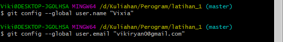 

# Perintah Dasar Git <h2>
* _**git init**_, perintah untuk membuat repository local
* _**git add**_, perintah untuk menambahkan file baru, atau perubahan
pada file pada staging sebelum proses commit. 
* _**git commit**_, perintah untuk menyimpan perubahan kedalam database git. 
* _**git push -u origin master**_, perintah untuk mengirim perubahan pada repository 
local menuju server repository. 
* _**git clone [url]**_, perintah untuk membuat working directory yang diambil dari 
repositry sever.
* _**git remote add origin [url]**_, perintah untuk menambahkan remote 
server/reopsitory server pada local repositry (working directory)

# Membuat Reposiory Local <h2>
1. Buka direktory aktif, misal: **D:\Kuliahan**

2. Buat direktory project praktikum pertama dengan nama Program

3. Sehingga terbentuk satu direktori baru dibawahnya, selanjutnya masuk kedalam direktori tersebut dengan perintah cd (change
directory)

4. ubah direktory aktif menjadi: **D:\Kuliahan**

5. Buatlah direktory **"Latihan_1"** kemudian masuk ke direktory tersebut 
# 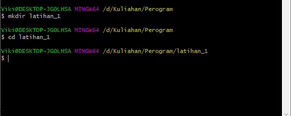 <h2>

6. Lakukan **"git init"** untuk menjadikan repository lokal 
# 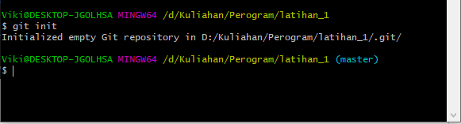 <h2>

7. Buat File Bernama **"README.md"** (text file), jika file berhasil dibuat, akan tampil seperti dlm gambar
# 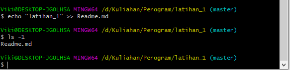 <h2>

8. kemudian tambahkan file tersebut ke repository dengan command 
> **git add README.md**, 
9. file yang berhasil ditambahkan akan terlihat seperti di 
gambar, dengan 
> "git status"

# 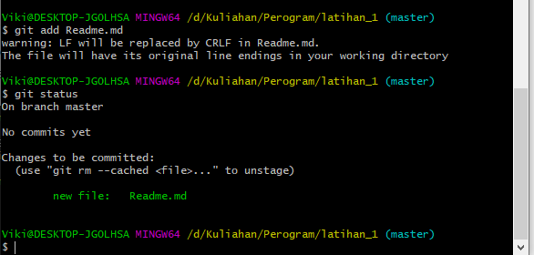 <h2>
</h2>
10  . Untuk  Menyimpan perubahan sebuah file ke repository local gunakan 
printah 
>**"git commit -m "perubahan yang terjadi"**

# 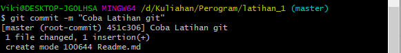

# Membuat repository server <h2>
1. Server reopsitory yang akan kita gunakan adalah http://github.com

2. Anda harus membuat akun terlebih dahulu. Pada laman github, klik tombol start a project, atau Dari menu (icon +) klik New Repository
# 

3. Isi nama repositorynya, misal: Latihan1.  

4. lalu klik tombol **Create repository**

# 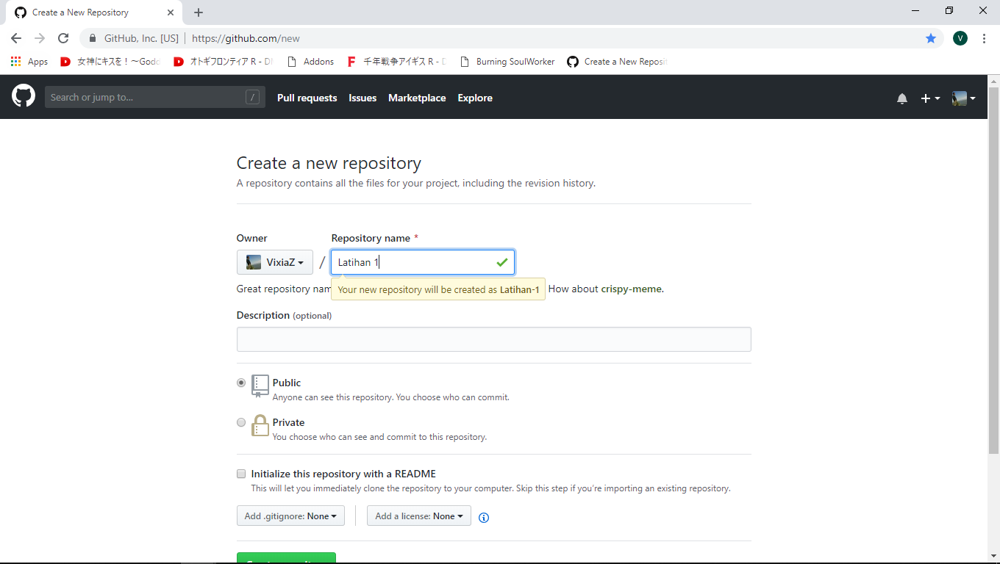

# Menambahkan Remote Repository <h2>
* Remote Repository merupakan repository server yang akan digunakan untuk menyimpan setiap perubahan pada local repository,
sehingga dapat diakses oleh banyak user. 

* Untuk menambahkan remote repository server, gunakan perintah
>**"git remote add origin [url]"**
# 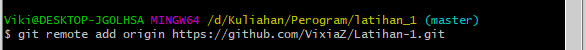
 
# Push (Mengirim perubahan ke server) <h2>
* Untuk mengirim perubahan pada local repository ke server gunakan perintah 
>**"git push."**

* Perintah ini akan meminta memasukkan **username dan password** pada akun **github.com**
# 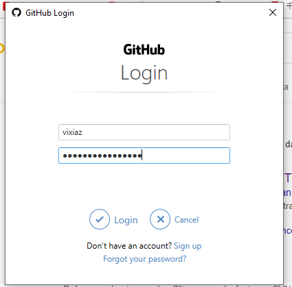

* Gunakan printah 
>**"git push -u origin master"** 
# 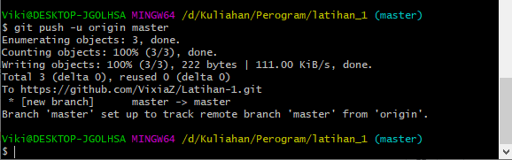

# Melihat hasilnya pada server repository <h2>
* Buka laman github.com, arahkan pada repositori- nya. 
* Maka perubahan akan terlihat pada laman tersebut. 
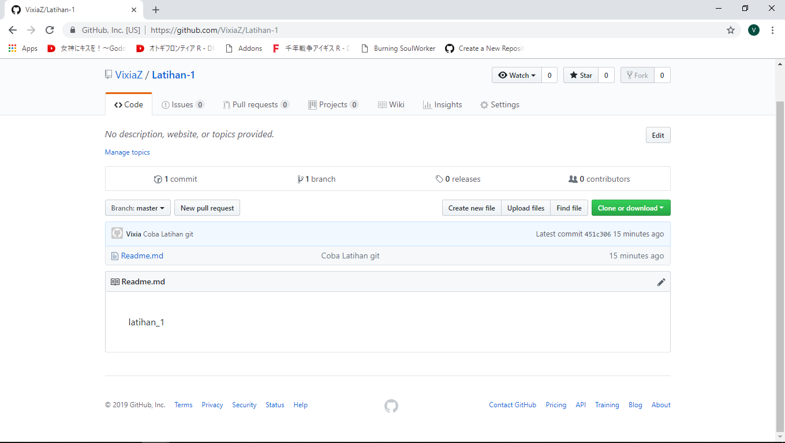
